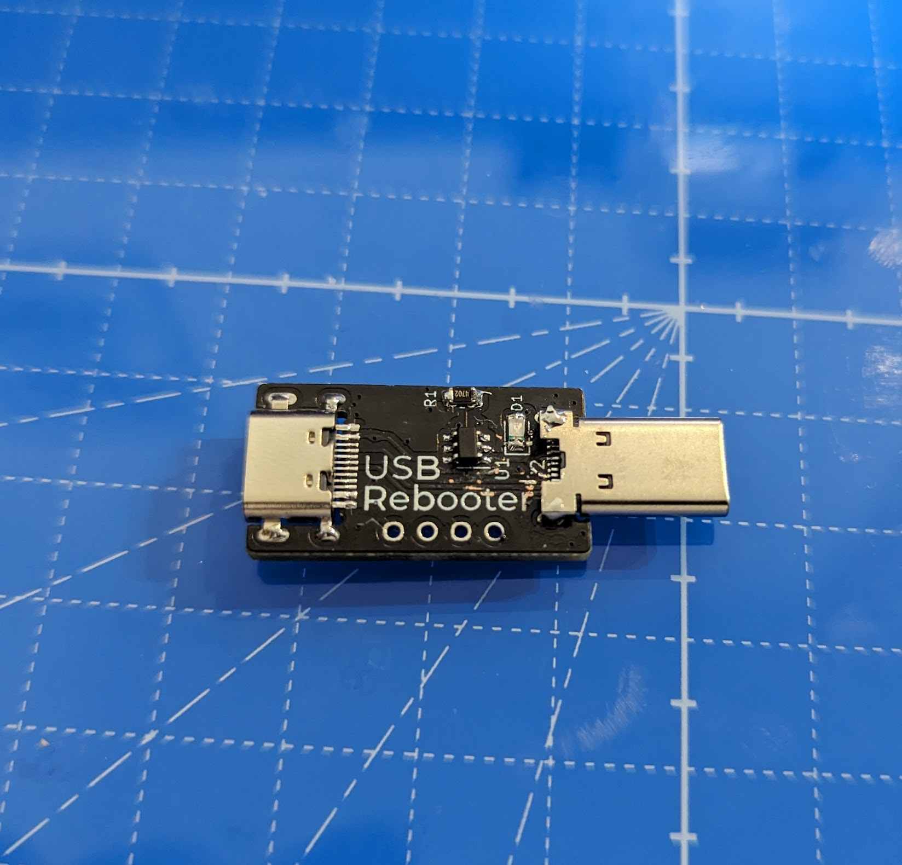
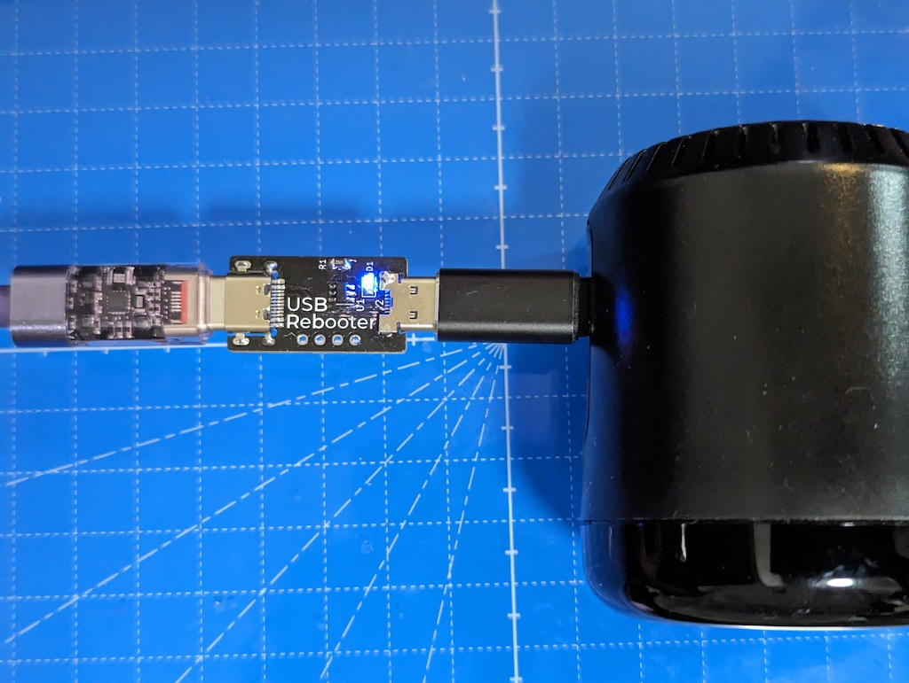

# Adapter to turn USB power on/off once every 12 hours

12 時間後とに USB 電源をオン/オフするためのアダプタ

## features

- turn USB power on/off once every 12 hours
- using CH217 for switching
- using CH32V003 for timer
- count down shown by UART

### Japanese

- 12 時間ごとに USB 電源をオン/オフする
- CH217 を使用して電源を切り替える
- CH32V003 を使用してタイマーを実装する
- UART でカウントダウンを表示する

## Documents

- semantics: [kicanvas](https://kicanvas.org/?github=https%3A%2F%2Fgithub.com%2F74th%2Fusb-rebooter%2Fblob%2Fv1.0.0%2Fpcb%2Fusb_auto_reboot.kicad_sch)
- pcb: [kicanvas](https://kicanvas.org/?github=https%3A%2F%2Fgithub.com%2F74th%2Fusb-rebooter%2Fblob%2Fv1.0.0%2Fpcb%2Fusb_auto_reboot.kicad_pcb)

## parts list

### v1.0.0

| Designator | Quantity | Designation                                   |
| ---------- | -------- | --------------------------------------------- |
| J1         | 1        | USB Type-C Mid-mount Socket Molex 216990-0002 |
| J2         | 1        | USB Type-C Plug 00402-UCAM002-X               |
| R1         | 1        | 0805 Register 56k                             |
| R2         | 1        | 0805 Register 10k                             |
| C1         | 1        | 0805 Capacitor 100n                           |
| C2         | 1        | 0805 Capacitor 10u                            |
| D1         | 1        | 0805 LED BLUE                                 |
| U1         | 1        | WCH CH217K                                    |
| U2         | 1        | WCH CH32V003J4M6                              |
| CH1        | 1        | SWD 1Wire TH                                  |
| CH2        | 1        | UART_TX TH                                    |

## License

MIT

We would appreciate it if you would not sell them. 販売はしないでいただけるとありがたいです。
